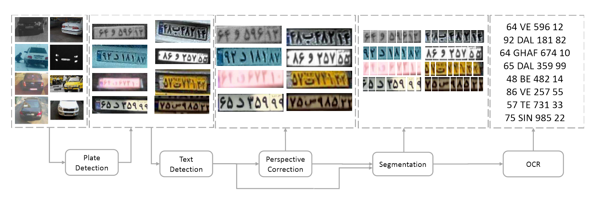
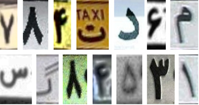
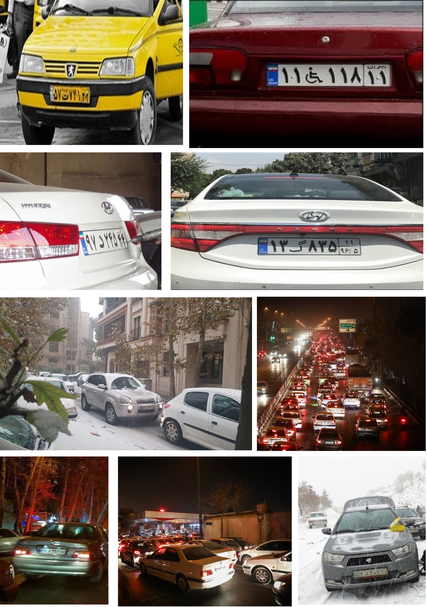

# RILP
### Robust Iranian License Plate Recognition Designed for Complex Conditions

This is a Modular Framework designed for License Plate Number Recognition in Complex Conditions.
The particular Design choice ables us to reconfigure the framework for other regions/Conditions in no time!



## Prerequisites
The Following Setup is tested and working:
- Python>=3.5
- Pytorch>=0.4.1
- Tensorflow>=1.12.2
- Cuda>=9.0
- opencv>=3.4.2

## Testing
- place the images inside **test_set/images** directory
- delete all other images inside folders (don't delete the folders, just files inside them)
- in main directory run: ```python3 runner.py```

## Training
- the pre-trained model provided, we will not publish the training code
- in order to train use pre-trained model or try another model

## datasets
### Glyphs


- properties:
	- volume: 5000 images
	- labeled
	- size: 100 x K  (20 < K < 100)
- link:
	- will be avaiable soon, stay tuned.

### Plates


- properties:
	- volume: 350 images
	- various conditions
	- various sizes
	- license plate number (only one of them) is labeled
- link:
	- will be avaiable soon, stay tuned.

## Citing
Please adequately refer to the papers any time this Work/Dataset is being used. If you do publish a paper where this Work helped your research, Please cite the following papers in your publications.

	@inproceedings{Samadzadeh2019RILP,
	  title={...},
	  author={Ali Samadzadeh, Amir Mehdi Shayan, Bahman Rouhani, Ahmad Nickabadi, Mohammad Rahmati},
	  year={2019},
	  organization={IEEE}}
